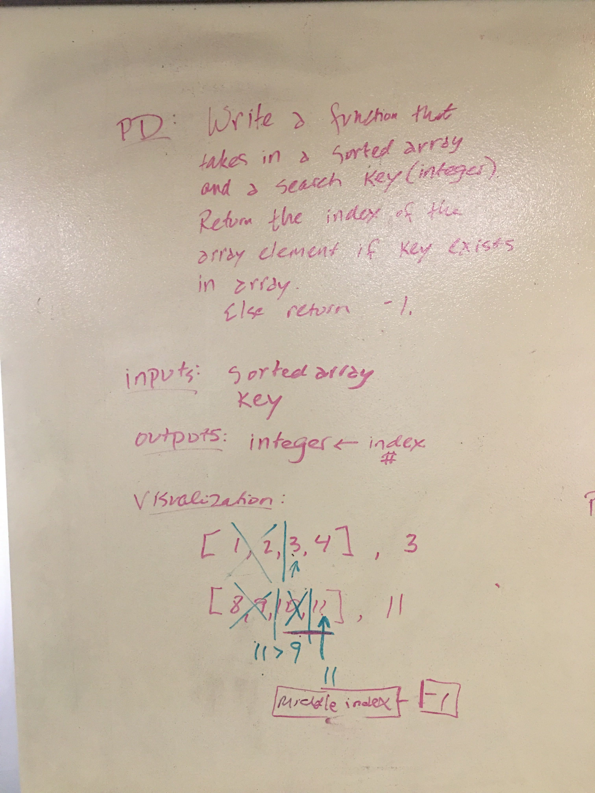
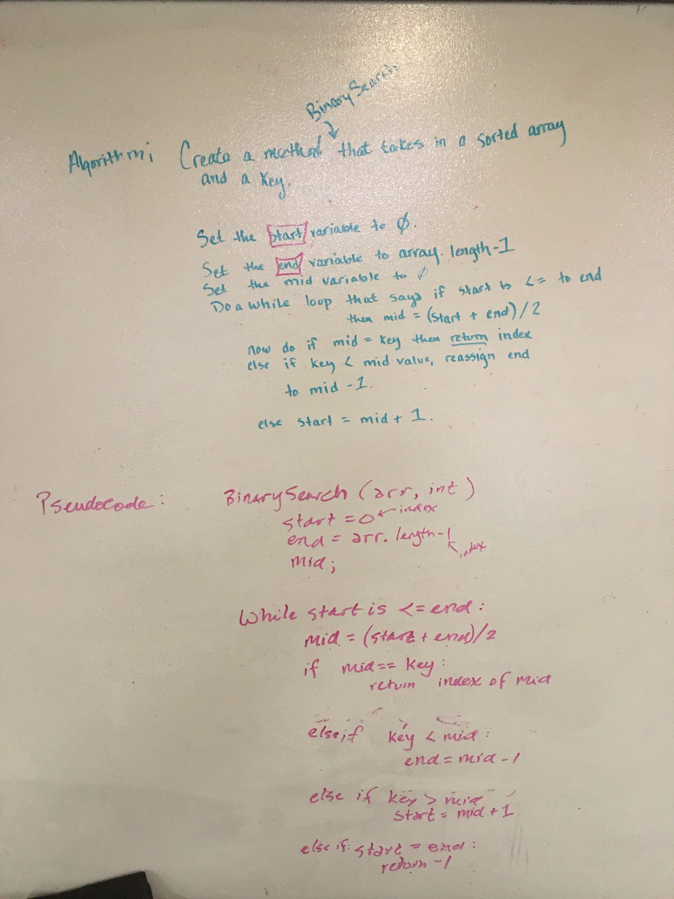

# Binary Search Tree for Arrays
Search an array of sorted numbers for a key using the O(lg(n)) concept.

## Challenge
Take in a sorted array and a search key (integer).  Return the index of the array element if the search key exists, and -1 if it does not exist.
input[1,2,3,4,5], 5
output = 4 

## Approach & Efficiency
The approach was to use the O(lg(n)) concept by getting the length of the array passed in, divide that in half to find the middle of the array, then look to see if your search key is > = or < than the array element at the middle.  Depending on the return of your if depends on if you get the length again and redo the first part or just return the index.  

## Solution

