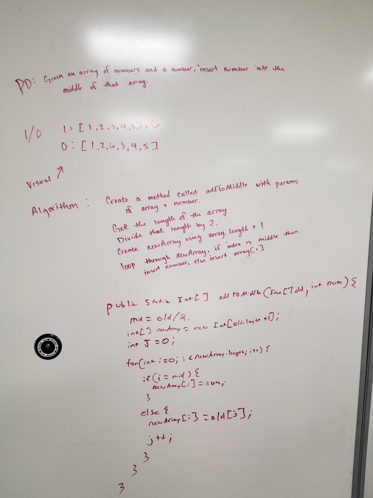

# Find a value in an array using a binary search
Take in two parameters:  a sorted array with no length and a search key.  

## Challenge
Take an array of integers that has an unknown length and a second integer that you want to insert into the middle of this array.
inputData: [1,2,3,4,5], 6 
outputData: [1,2,6,3,4,5]

## Approach & Efficiency
The approach was to find the length of the array you are passing in, then create a new array and using the length from the input array and add 1 because you are adding to the array.  Also take the length of the input array and divide that by 2 to get the middle.  Next step is to create a new variable which is just used as a counter.  Create a for loop that loops the length of your new array and if your i is equal to the middle number, then put the number you are passing in to that position, if you are not at the middle then continue through the loop placing items as normal and adding to the counter at the same time.  This is a hard one for me to explain it without visually showing it... so perhaps the solution picture will help better.  This solution is very close to the actual code, just a few tweaks. 

## Solution

