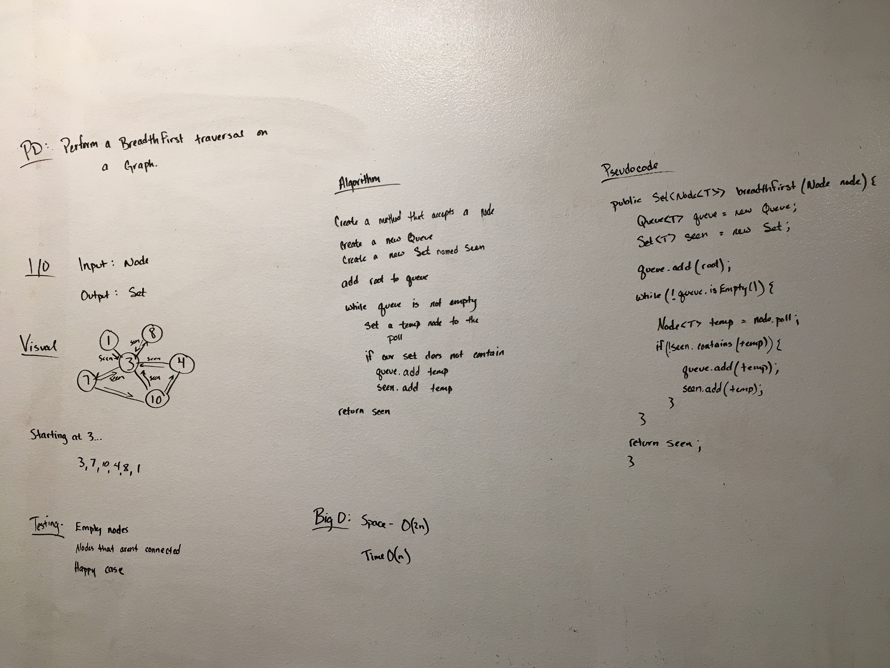
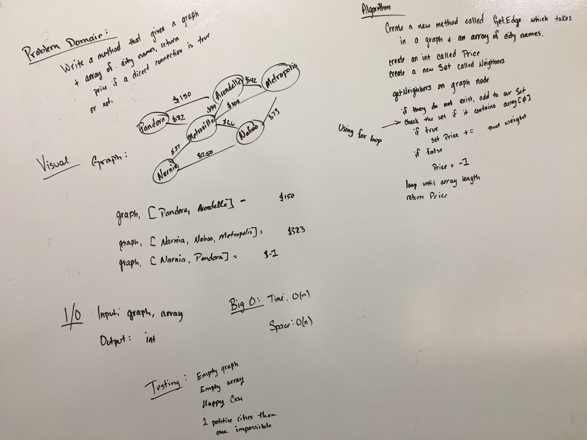

# Graphs

### This package contains the following methods
* addNode(T value) - Adds a single node to your graph.
* addEdge(Node T node1, Node T node2, int weight) - Connects two nodes together inside your graph.
* getNeighbors(Node T node) - Returns all of the connected nodes in your graph.

---

# BreadthFirst Traversal on a Graph

### Challenge
Traverse through a graph using breadthFirst

### API
breadthFirst(Node T) - Traverses through a graph using a breadthFirst approach.  Node can be any chosen node.

Input:
```
        3 ----- 5
       / \-4-6-/ \-42
      1   |        |
          12-------10 
```

Output:  4,5,6,42,10,12,3,1

### Approach
Approach was to add to a Queue & Set at the same time, provided that the Set does not contain the current value.  Repeat until the node is empty.

### Solution



# GetEdge on a graph

### Challenge
Given a list of airports and direct flights, see if it is possible to fly directly from one airport to another.  If it is possible, return the cost of the flight.

### API
* getEdge(Node graph, String[] cities) - Takes in your graph and the city names that you want to see if a direct flight is possible to.

Graph:
```
                  $150
    pandora ---------------- arendelle
           \ $82              $105    \ $42        
             -- metroville ------- metropolis
           $37  /       \ $26         / $73 
     narnia----/---------\ -------- naboo
                  $250            
```

Input:  graph, [pandora, arendelle] == 150
Input:  graph, [pandora, metroville, naboo] == 108
Input:  graph, [pandora, naboo] == -1   

### Approach
Approach was to grab the starting city from our graph, then loop through our array and compare the neighboring city names to the array index and either add up the price if true, or return -1 if false.*

### Solution
