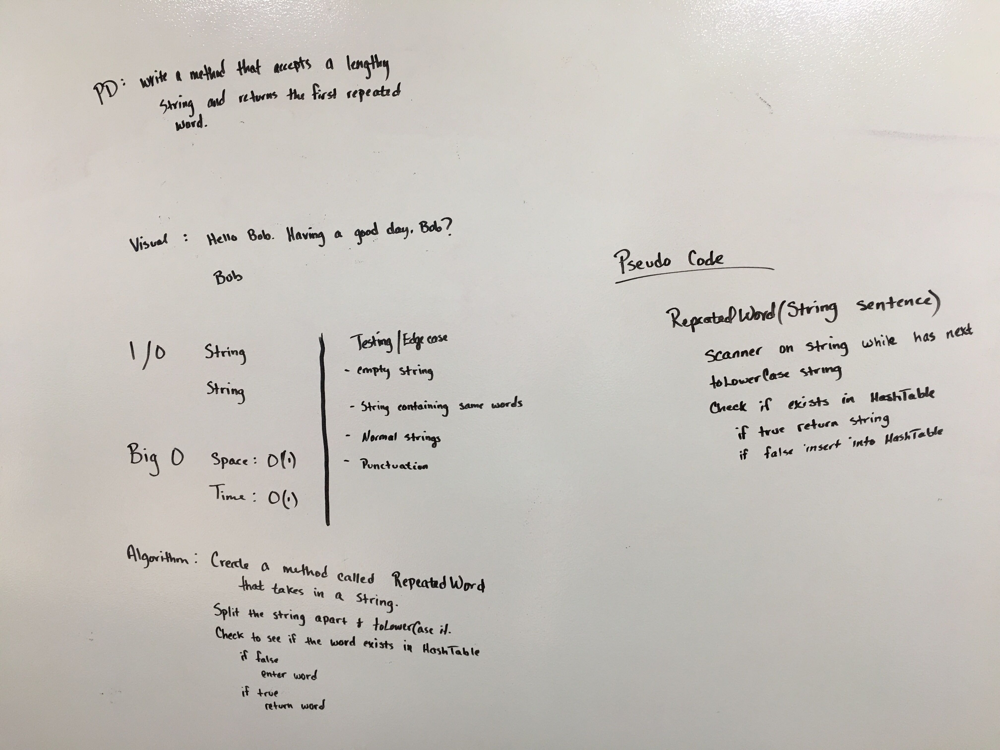

# Hashtables

This class contains the following methods
* .add(String key, int value) 
  * This will add a value to the hashtable.
* .get(String key)
  * This will return the value of the key, or return -1 if it does not exist.
* .contains(String key)
  * This will return true if the key is found, or false if it does not exist.
  
# RepeatedWord
Using a Hash table, find the first duplicate word in any given string.

## Challenge
Using a Hash table, find the first duplicate word in any given string.

Input: `This is a beautiful string, a string that is nice and simple.`

Output: `a`

## Approach & Efficiency
Approach was to user a scanner to break the sentence apart, then check if that string exists in a Hash Table.  If it does not exist, then enter it in.  Repeat until duplicate occurs or end of string.

## Solution
 