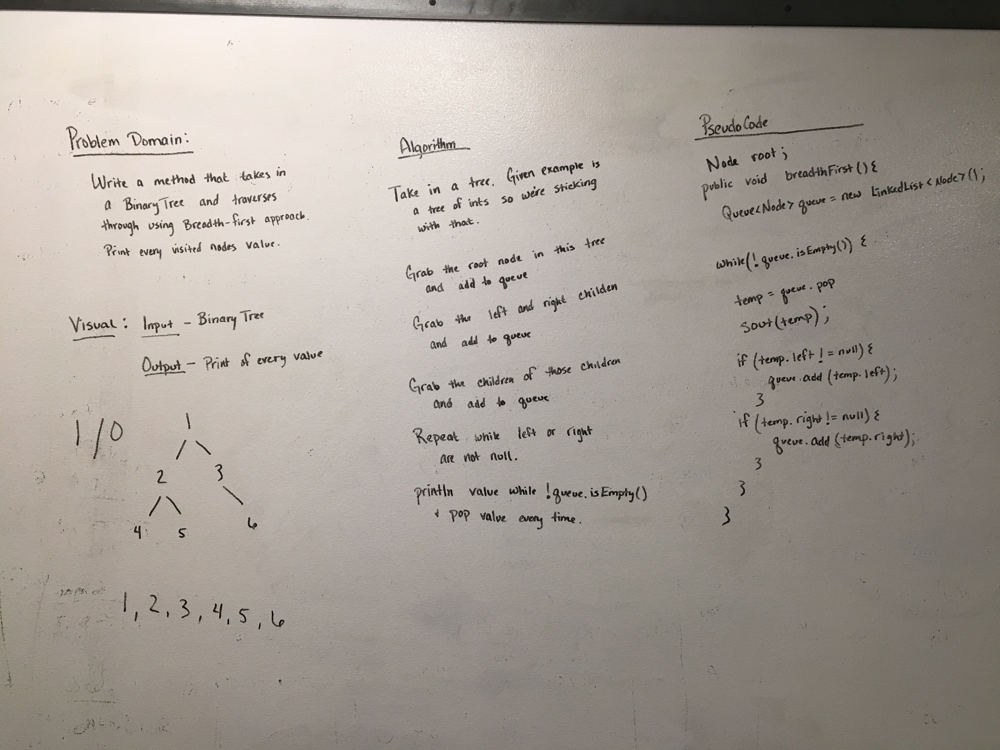
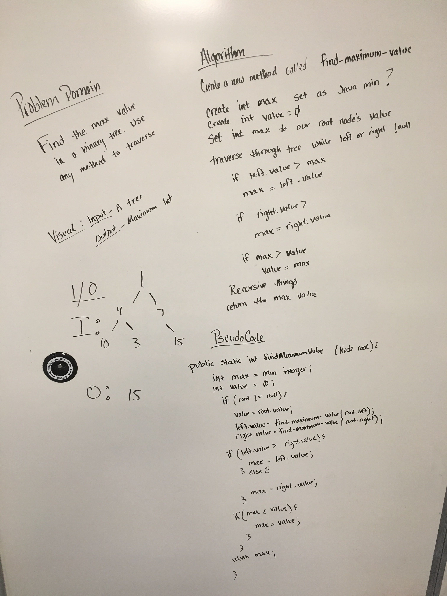

# Trees
Create a Tree!

## Challenge
Implement a binary search tree and traverse through it.

## API
* BinarySearchTree.add(int value); - This adds a value to your tree!
* BinarySearchTree.contains(int value); - This will search the tree for this value!

* Tree.preOrder() - This returns the tree in order that you created it
* Tree.inOrder() - This returns the tree in numerical order lowest to highest
* Tree.postOrder() - This returns the tree in numerical order highest to lowest
* Tree.breadthFirst() - This returns the tree in row order, top to bottom.
 
 
 # Implement a Queue using two Stacks
 Traverse through a tree using the Breadth-First approach.
 
 ## Challenge
 Traverse through a tree using the Breadth-First approach.  Print every value visited to the console.
 
 Input:
```
     1
    / \
   5   7
  / \   \
 9   3   0 
```

Output:

1, 5, 7, 9, 3, 0
 
 ## Approach & Efficiency
 The approach was to create a queue and add every every left and right value to it, printing the values along the way.  This in terms means we hit every node from left to right, top to bottom.
 
 ## Solution
 
 
 
 ___
 
 # Find the max value in a tree
 
 ## Challenge
 Find a max value in a tree and return that value
  Input:
 ```
      1
     / \
    5   7
   / \   \
  9   3   0 
 ```

Output: 9
 
 ## Approach & Efficiency
 The approach was using recursion to traverse through the entire tree and set the values based on greater than or not.  Return that int afterwards.
 
 ## Solution
 
 
 
