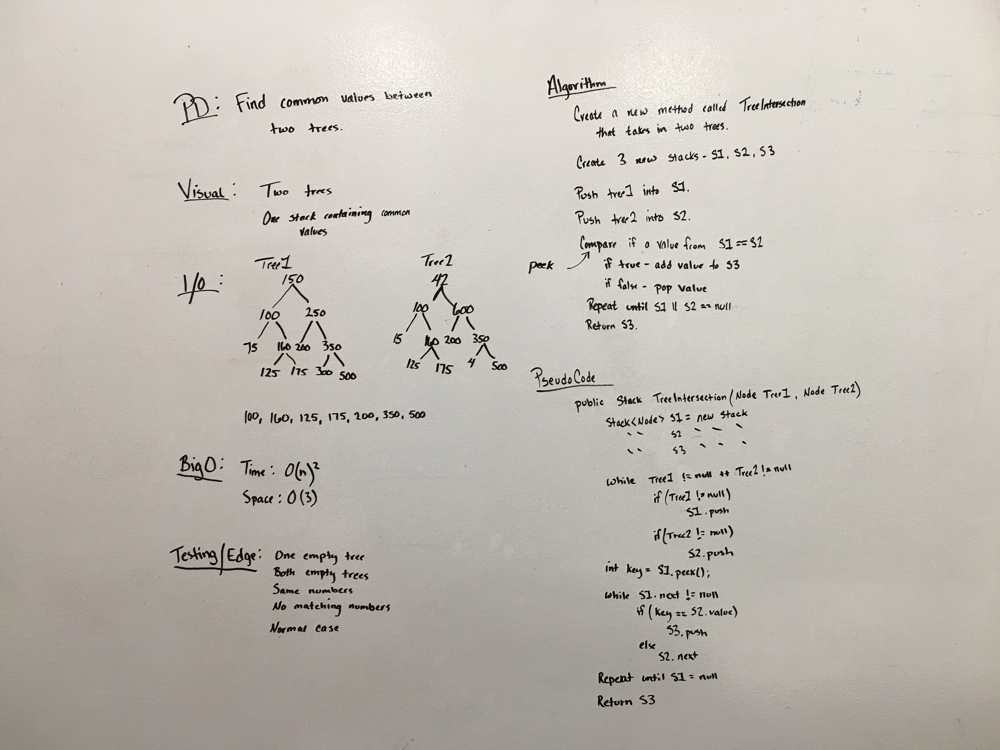

# Trees
Find common values between two trees.

## Challenge
Find common values between two trees.

Input:
```
     1                          10
    / \                        /  \
   5   7                      5    9
  / \   \                    / \    \
 9   3   0                  9   7    12
```

Output:

5, 9, 7
 
 ## Approach & Efficiency
The approach was to use two trees, break them apart into individual stacks and then compare the two stacks to each other.  If a common value was found, then push that value to the third stack.  At the end, return the third stack.
 
 ## Solution
 
