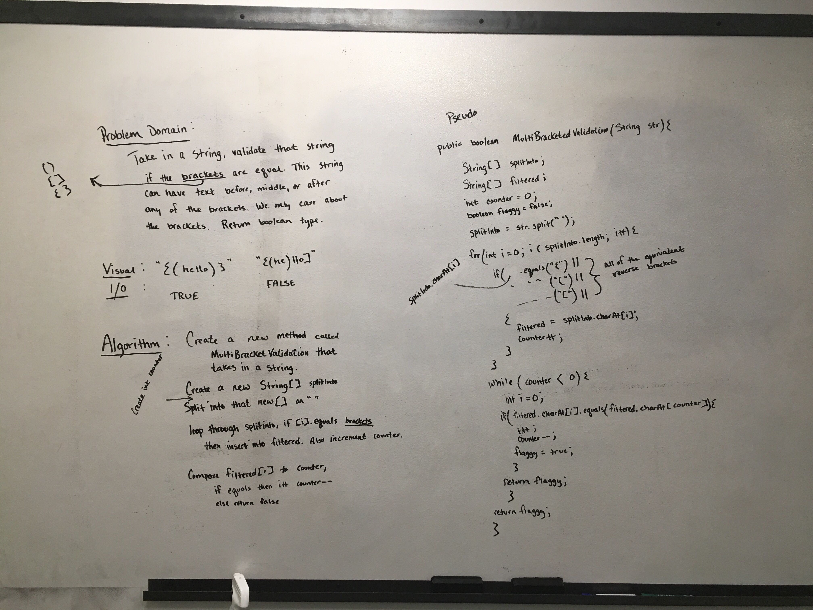

# Search a string for matching characters.
Search a string to see if there are matching bracket sets.  Return boolean.    

## Challenge
Take in a string that can contain any amount of characters, special or not.  Search through this string and see if the brackets have matching sets.  Return a boolean answer.

Input:  `{[(hello)]}` | `[hel]lo)` | `h{e(l[l]o)!}!`  
Output: true | false | true

## Approach & Efficiency
Approach was to take in a string, split it into an array, filter that array down to just the specific bracket characters, then search that array if each character matches.  Return a boolean answer based on findings. 

## Solution

