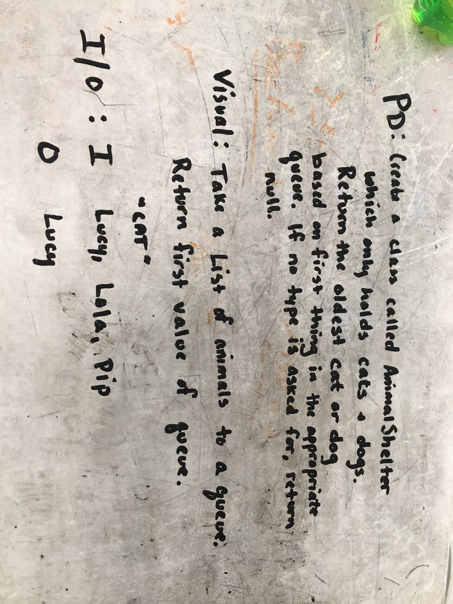
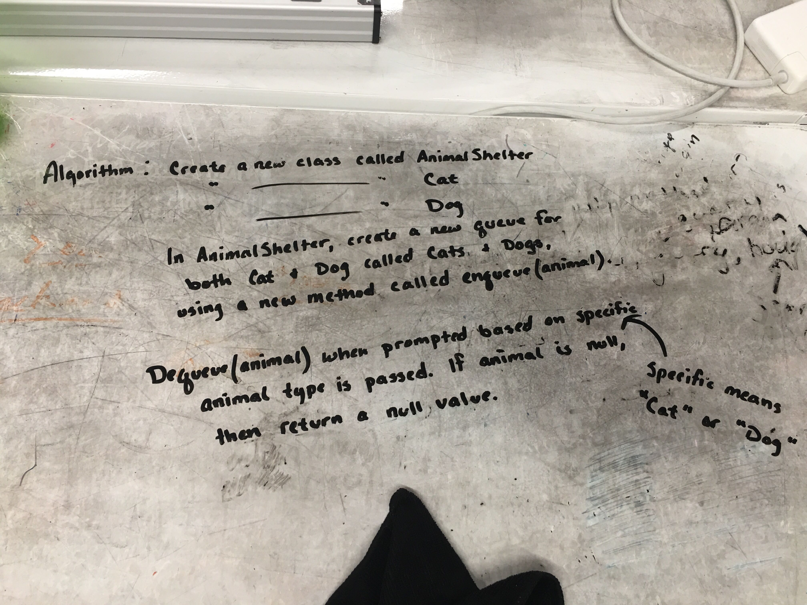
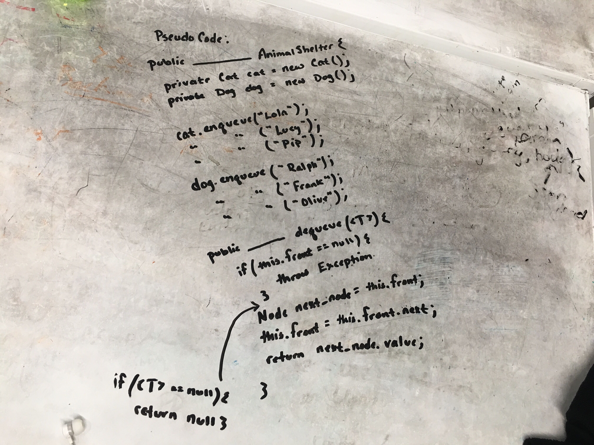

# Using a queue method, return the oldest object in that queue.
Take in a parameter `pref` into your dequeue method.  Pref can be `cat` or `dog`, and will return the oldest object within that specific queue.  

## Challenge
Take in a parameter `pref` into your dequeue method.  Pref can be `cat` or `dog`, and will return the oldest object within that specific queue.
Input:  'lucy', 'lola', 'pip' 
Output: 'lucy'

## Approach & Efficiency
Approach was to utilize existing methods and just return the head from the desired queue. 

## Solution

